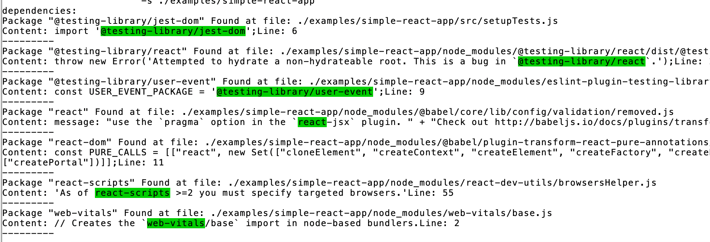

### WhereIsDep


####  C++ CLI application to search package.json dependencies in given directories.





##### Run:
Using make:
```bash
make run
```
Using bin file:
```bash
./whereisdep \
	-p ./examples/simple-react-app/package.json \
	-s ./examples/simple-react-app \
	-e 
```

##### [for development] Compile and run:
```bash
make buildandrun
```


#### CLI options:


| option                       | description                               | is required                                            | default value      |
| :---                         | :---                                      | :---                                                   | :---               |
| -h \| --help                 | Display this help menu                    | <small><span style="color:gray;">(no)</span></small>   | N/A                |
| -p \| --packageJsonFilePath  | Set the path of the package.json file     | <small><span style="color:red;">(* yes)</span></small> | N/A                |
| -s \| --searchDir            | Set the searching directory of JS files   | <small><span style="color:red;">(* yes)</span></small> | N/A                |
| -e \| --ext                  | Set the target search files extensions    | <small><span style="color:gray;">(no)</span></small>   | [".js", ".jsx"]    |


  
  
  
#### Add executable file to your bin folder
To use whereisdep globally from any terminal window `$ whereisdep` :
- Mac/Linux: `cp whereisdep /usr/local/bin/whereisdep`
  
  
  
----------------------------------------------------------------

#### TODO

- [x] Versioning
- [x] Coloring match substring
- [ ] Testing
- [ ] CI/CD pipeline
- [ ] Themes
- [ ] Dockerizing
- [ ] Exporting
- [ ] Perform Actions (package by package)
- [ ] Optioning json keys
- [ ] Optioning exclude searching paths
