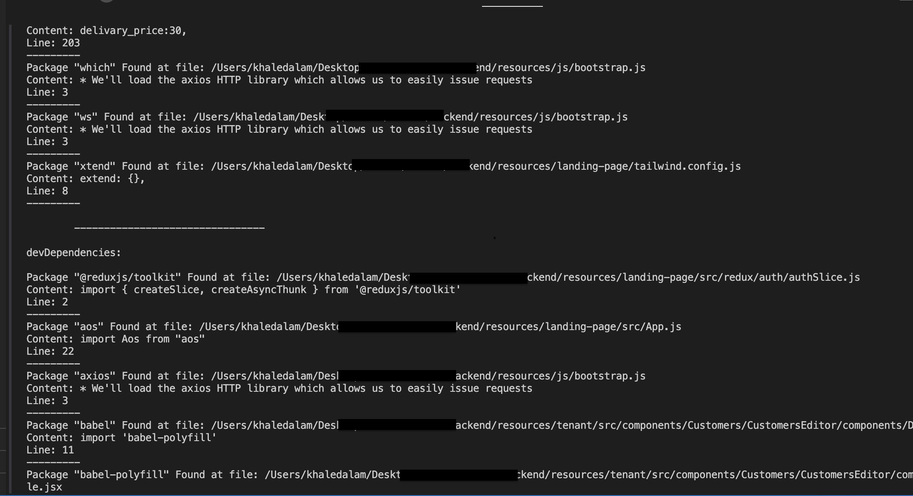

### WhereIsDep


####  C++ CLI application to search package.json dependencies in given directories.





##### ext: `".js", ".jsx"`

```shell
g++ -std=c++17 whereisdep.cpp && ./a.out --packageJsonFilePath="/Users/khaledalam/.../package.json" --searchDir="/Users/khaledalam/.../resources"
```